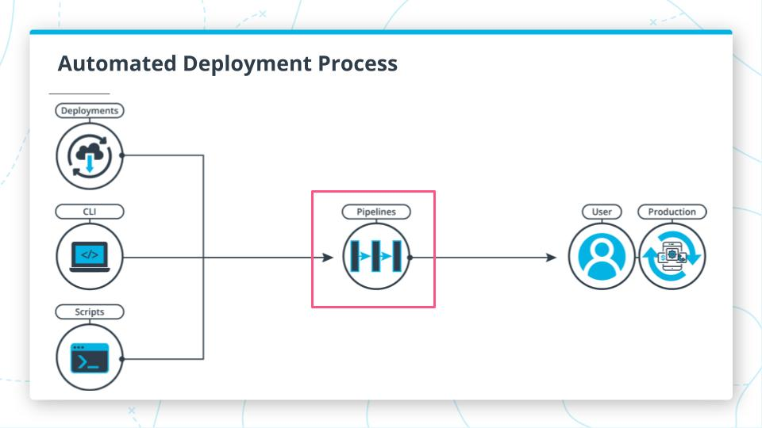

# Udagram

This application is provided to you as an alternative starter project if you do not wish to host your own code done in the previous courses of this nanodegree. The udagram application is a fairly simple application that includes all the major components of a Full-Stack web application.

## Pipline

circleci pipeline is triggered when a new commit is pushed to "main" branch



## Dependencies

```md

- Node v14.15.1 (LTS) or more recent. While older versions can work it is advisable to keep node to latest LTS version
- npm 6.14.8 (LTS) or more recent, Yarn can work but was not tested for this project
- AWS CLI v2, v1 can work but was not tested for this project
- A RDS database running Postgres.
- A S3 bucket for hosting uploaded pictures.

```

## Installation

A file named `set_env.sh` has been prepared as an optional tool to help you configure these variables on your local development environment.

```sh
export POSTGRES_USERNAME=your_postgres_username
export POSTGRES_PASSWORD=your_postgres_password
export POSTGRES_HOST=db_host
export POSTGRES_DB=postgres
export DB_PORT=5432
export PORT=3000
export AWS_BUCKET=arn:aws:s3:::your-bucket
export AWS_REGION=us-east-1
export AWS_PROFILE=default
export JWT_SECRET=mysecretstring
export URL=url

```

The dependencies required to run:

- `Node` v14.15.1 (LTS), or more recent. While older versions can work, it is advisable to keep Node to the latest LTS version
- `npm` 6.14.8 (LTS), or more recent. Yarn can work but was not tested for this project
- `AWS` CLI v2, v1 can work but was not tested for this project

## Infrastructure

- RDS
  - provides a public accessible PostgreSQL dataase
- S3
  - provides the frontend hosting
  - and a place where the backend saves uploaded images
- Elastic Beanstalk
  - provides the backend hosting


## deploy scripts

`backend:deploy` to deploy udagram api to EB.</br>
`frontend:deploy` to deploy udagram front end to S3.

link to deployed frontend: <http://udagram-mc456.s3-website-us-east-1.amazonaws.com>
